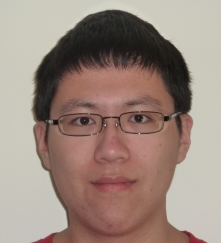

I'm an MS student studying Biostatistics at Case Western Reserve University. My Bachelor's degree was in Chemistry and I have three years of experience doing pre-prep work at an environmental lab. I'm currently working in [Dr. Koroukian's lab](https://case.edu/cancer/members/member-directory/siran-m-koroukian) cleaning and analyzing SEER-Medicare data using SAS, and I'm interested in finding a full-time position assisting with biomedical research.

I'm also interested in learning more about R and SAS programming. [Here](PatrickWu-Study1.html) [are](PatrickWu-Study1.html) two examples of projects I've built using R and R Markdown. I've also obtained the Base Programming 9.4 SAS certification, which you can find [here](https://www.youracclaim.com/badges/99db93af-c500-4580-a5db-03c41e282e4f/public_url).


Finally, my resume contains more detailed information about my background.


```{r, echo=FALSE}
xfun::embed_file('Resume.docx')
```
